# All Images Embed Code - Categorized

This file provides ready-to-use embed codes that display **all 17 images** organized by category in a single block.

---

## 📋 Complete HTML Embed Code

Copy and paste this HTML code to embed all categorized images:

```html
<!-- ArchXv2 Image Gallery - All Images by Category -->

<!-- Biệt thự (Villa) - 4 images -->
<h2>🏡 Biệt thự (Villa)</h2>
<div style="display: grid; grid-template-columns: repeat(auto-fit, minmax(250px, 1fr)); gap: 20px; margin-bottom: 40px;">
    <div>
        
        <p><small>50 Gorgeous House Arch Designs</small></p>
    </div>
    <div>
        
        <p><small>Modern Japanese House</small></p>
    </div>
    <div>
        
        <p><small>Where Modern Elegance Meets Timeless Grandeur</small></p>
    </div>
    <div>
        
        <p><small>Villa Image</small></p>
    </div>
</div>

<!-- Công Trình (Construction) - 6 images -->
<h2>🏗️ Công Trình (Construction)</h2>
<div style="display: grid; grid-template-columns: repeat(auto-fit, minmax(250px, 1fr)); gap: 20px; margin-bottom: 40px;">
    <div>
        
        <p><small>Structure</small></p>
    </div>
    <div>
        
        <p><small>Itajaí Laguna 182</small></p>
    </div>
    <div>
        
        <p><small>Modern Residence Facade</small></p>
    </div>
    <div>
        
        <p><small>Projetar Studio</small></p>
    </div>
    <div>
        
        <p><small>Stylish Apartment Building</small></p>
    </div>
    <div>
        
        <p><small>Thiết kế nhà ống 7 tầng</small></p>
    </div>
</div>

<!-- Nhà Phố (Townhouse) - 7 images -->
<h2>🏘️ Nhà Phố (Townhouse)</h2>
<div style="display: grid; grid-template-columns: repeat(auto-fit, minmax(250px, 1fr)); gap: 20px; margin-bottom: 40px;">
    <div>
        
        <p><small>22-24 Napier Street</small></p>
    </div>
    <div>
        
        <p><small>58 Sleek Modern Villa Designs</small></p>
    </div>
    <div>
        
        <p><small>Urban Architectural Perfection</small></p>
    </div>
    <div>
        
        <p><small>Elegant White Townhouse</small></p>
    </div>
    <div>
        
        <p><small>Budget-Friendly Modern Townhouse</small></p>
    </div>
    <div>
        
        <p><small>Transform Your Townhouse</small></p>
    </div>
    <div>
        
        <p><small>Architectural Design</small></p>
    </div>
</div>
```

---

## 📝 Complete Markdown Embed Code

Copy and paste this Markdown code to embed all categorized images:

```markdown
## 🏡 Biệt thự (Villa)

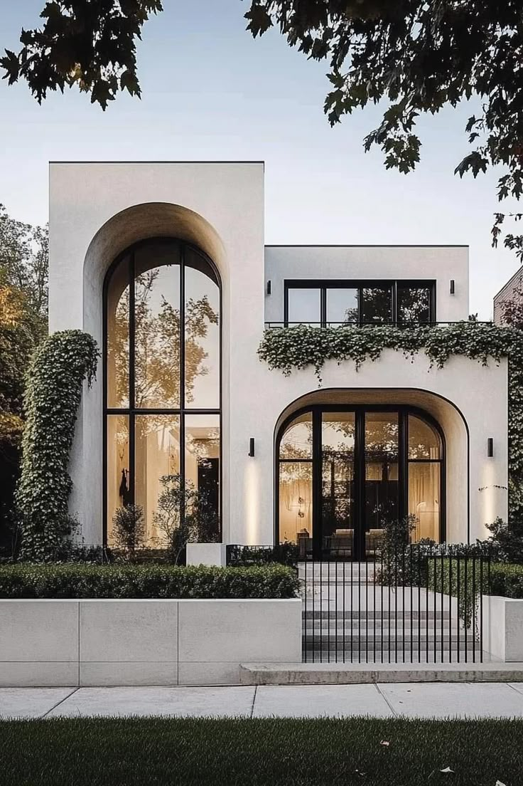
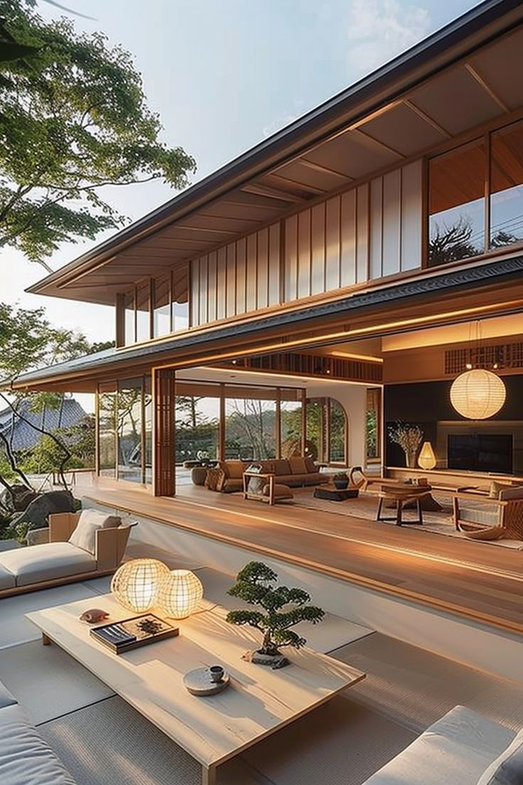
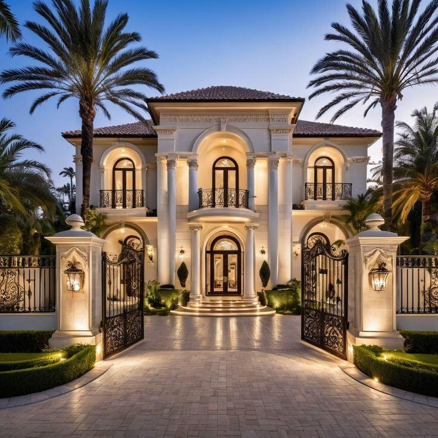
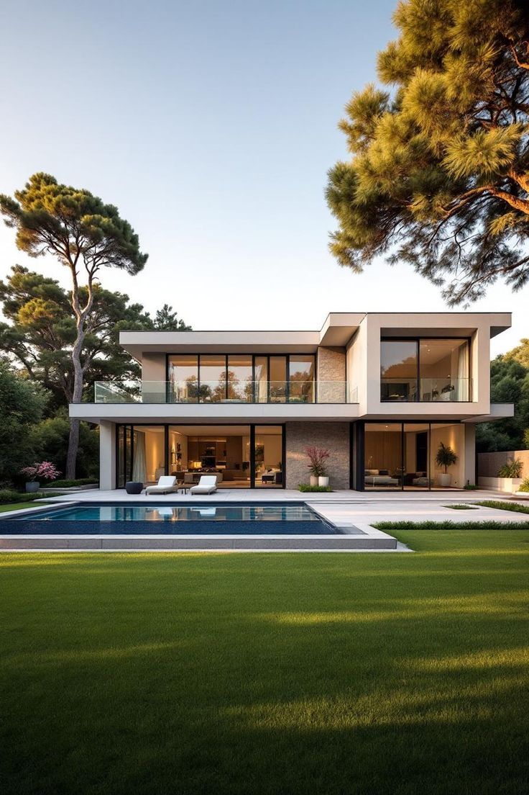

---

## 🏗️ Công Trình (Construction)

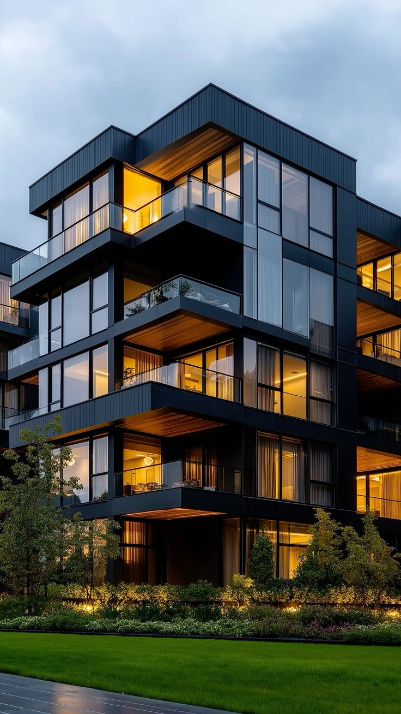
 Itajaí _ Laguna 182 _ 30 pavimentos….jpg)
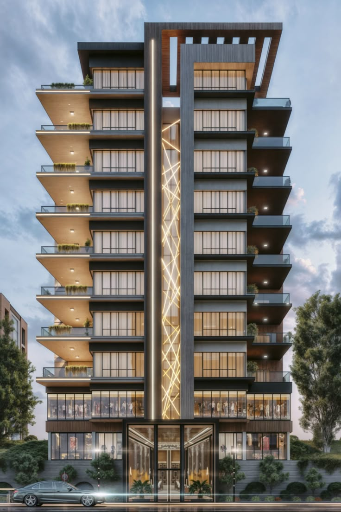
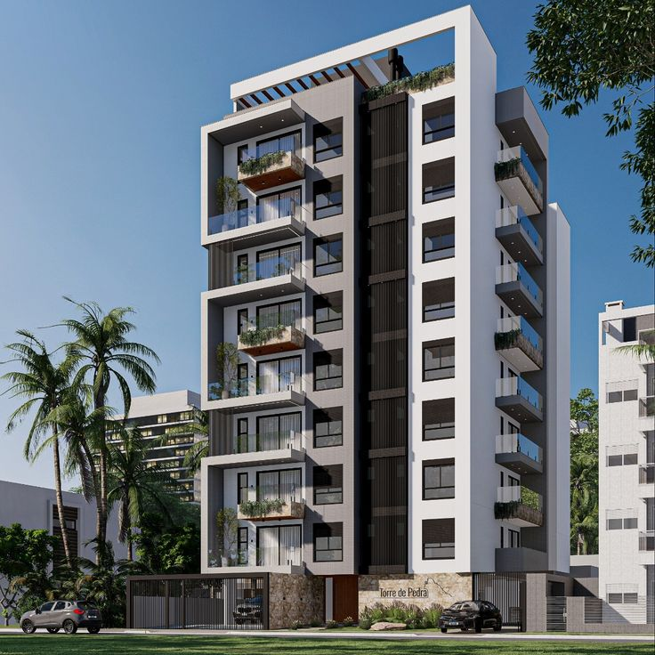
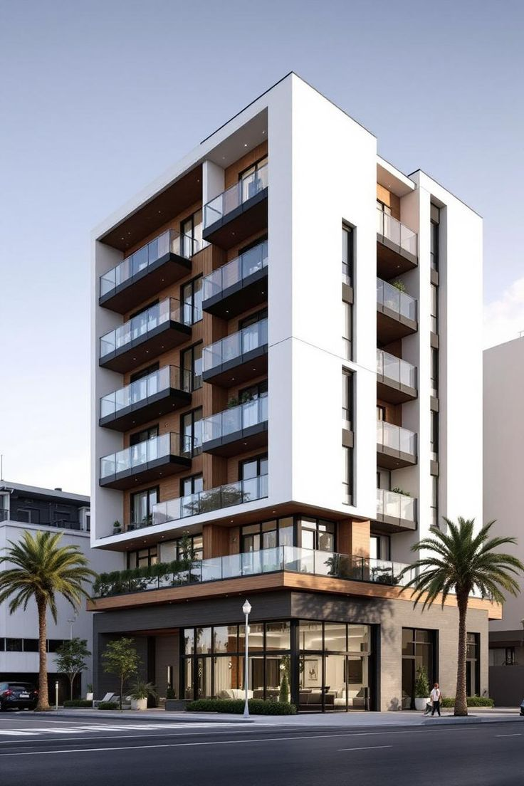
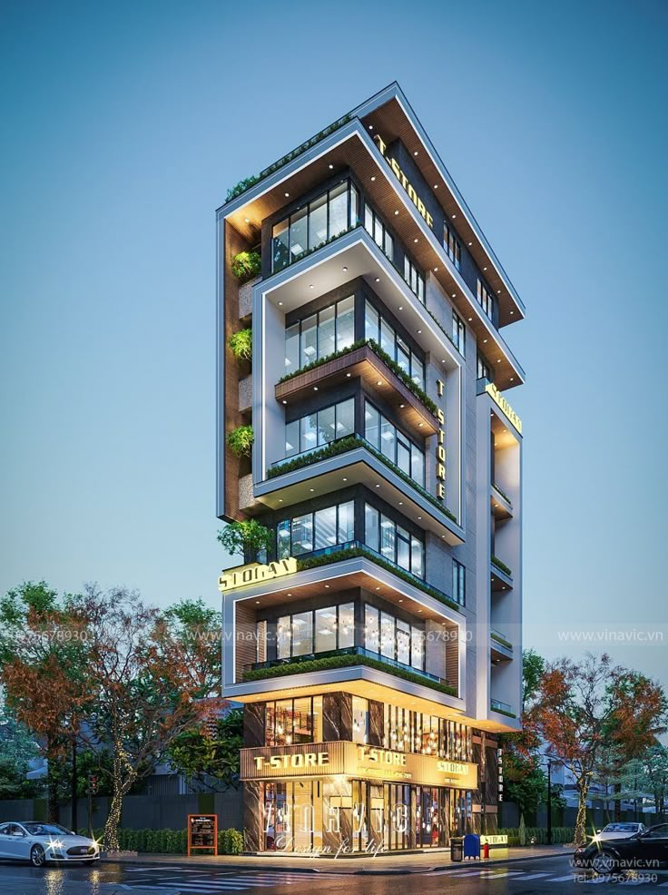

---

## 🏘️ Nhà Phố (Townhouse)

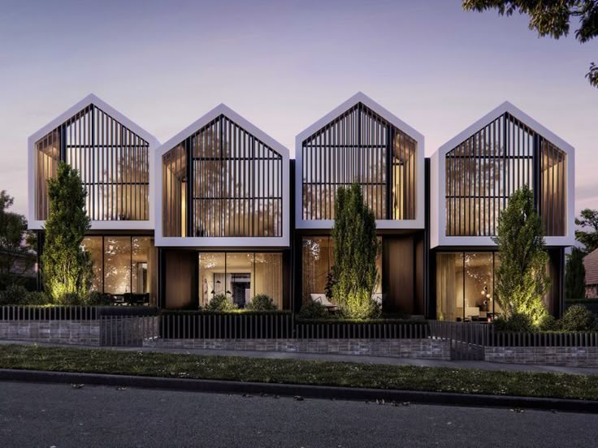
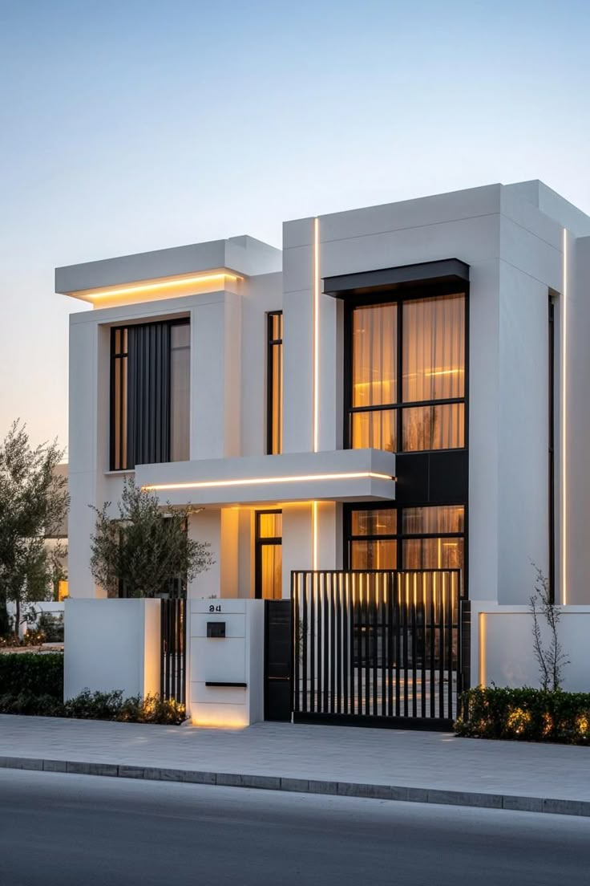
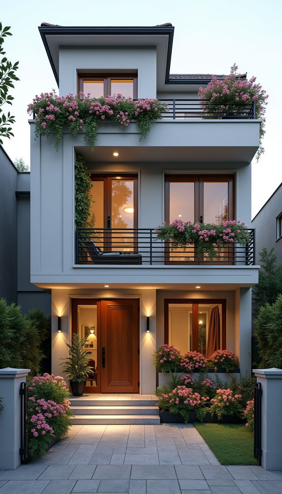
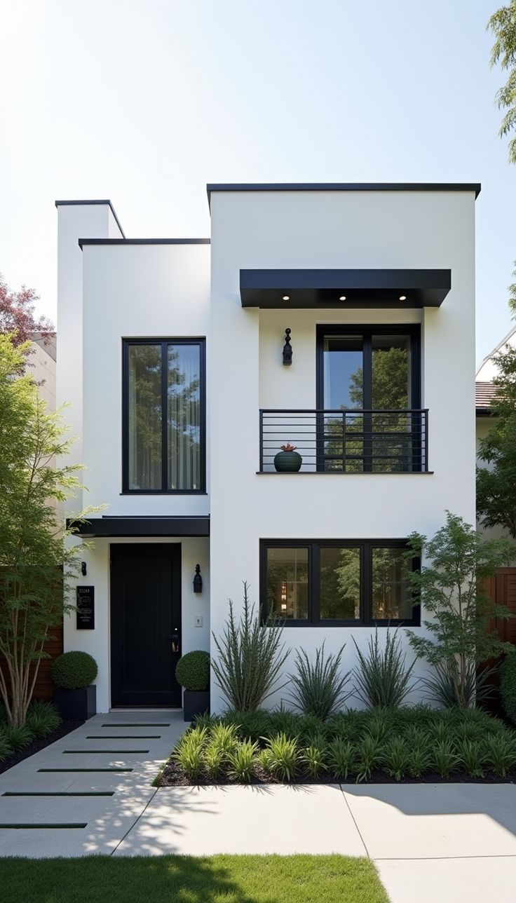
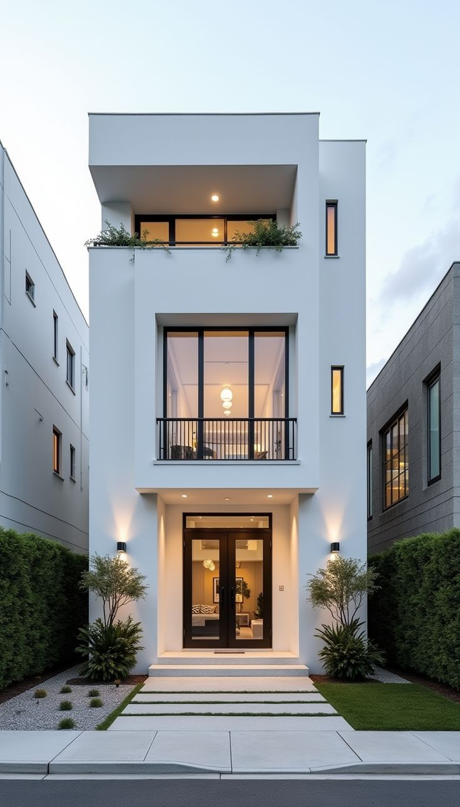
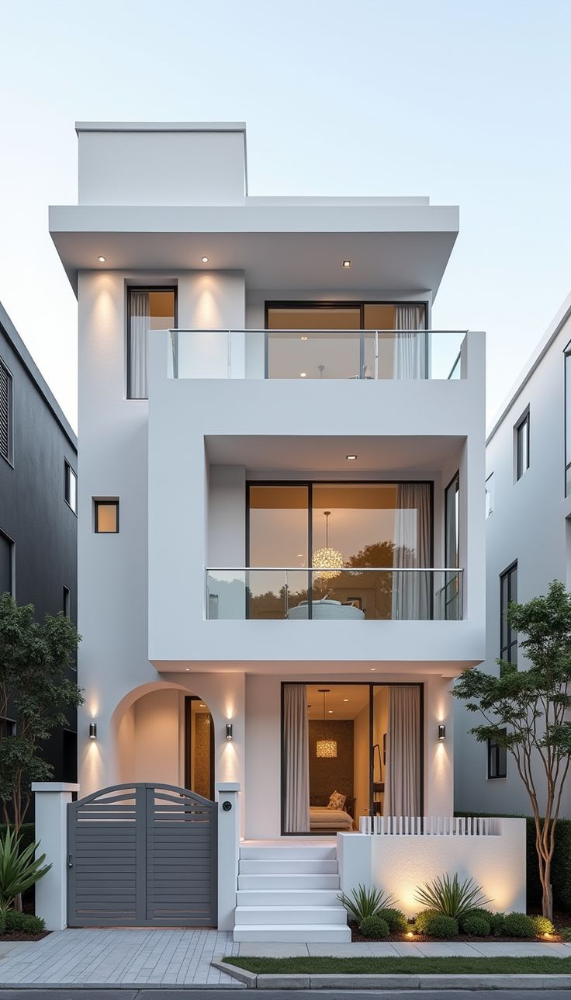
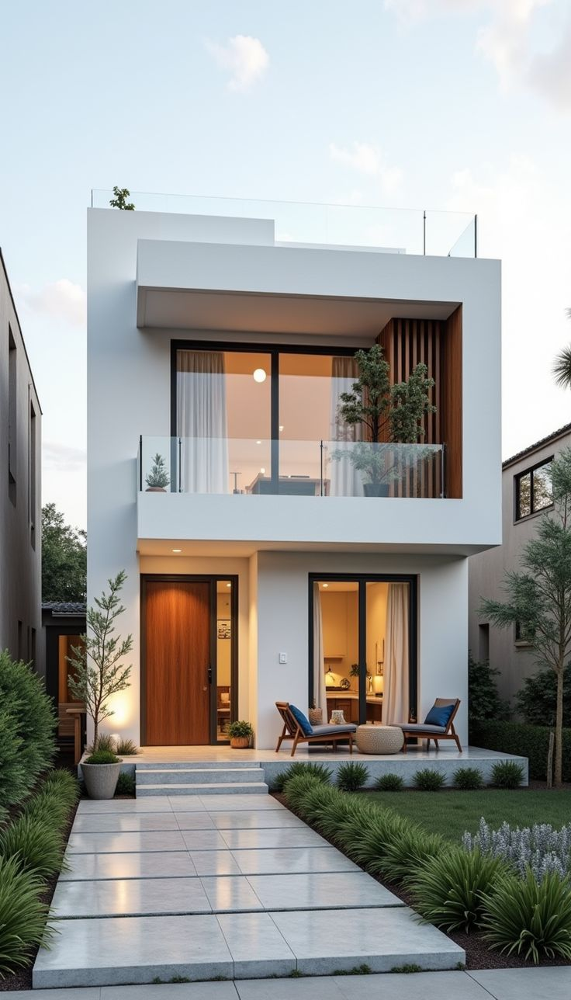
```

---

## 🔗 Simple List Format (All Links by Category)

### Biệt thự (Villa) - 4 images
```
Biệt thự/50 Gorgeous House Arch Designs That Redefine….jpg
Biệt thự/Modern Japanese House_ Minimalist and Harmonious….jpg
Biệt thự/Where Modern Elegance Meets Timeless Grandeur🏡🌿….jpg
Biệt thự/image.png
```

### Công Trình (Construction) - 6 images
```
Công Trình/#structure.jpg
Công Trình/(SC) Itajaí _ Laguna 182 _ 30 pavimentos….jpg
Công Trình/MODERN RESIDENCE  FACADE.jpg
Công Trình/Projetar Studio também é sinônimo de qualidade em….jpg
Công Trình/Stylish apartment building with balconies and palm….jpg
Công Trình/Thiết kế nhà ống 7 tầng có thang máy vừa ở vừa….jpg
```

### Nhà Phố (Townhouse) - 7 images
```
Nhà Phố/22-24 Napier Street, North Strathfield, NSW 2137….jpg
Nhà Phố/58 Sleek Modern Villa Designs to Inspire Your Next….jpg
Nhà Phố/Be amazed by urban architectural perfection! This….jpg
Nhà Phố/Elegant White Townhouse with Black Accents….jpg
Nhà Phố/Save this budget-friendly modern townhouse….jpg
Nhà Phố/Transform your townhouse with this stunning white….jpg
Nhà Phố/Visit the link to shop the image! Architectural….jpg
```

---

## 📊 Summary

- **Total Images:** 17
- **Categories:** 3
  - 🏡 Biệt thự (Villa): 4 images
  - 🏗️ Công Trình (Construction): 6 images
  - 🏘️ Nhà Phố (Townhouse): 7 images

---

## 💡 Usage Instructions

### For HTML Websites:
1. Copy the complete HTML embed code above
2. Paste it into your HTML file where you want the images to appear
3. Update the `src` paths if needed (add base URL if hosting elsewhere)

### For Markdown/Documentation:
1. Copy the complete Markdown embed code above
2. Paste it into your `.md` file
3. Update image paths if needed

### For Simple Link Lists:
1. Use the simple list format for quick reference
2. Each category is clearly separated
3. Copy individual links or entire category lists as needed

---

## 🌐 Base URL Configuration

When embedding on external sites, prepend the base URL to image paths:

**Examples:**
- GitHub Raw: `https://raw.githubusercontent.com/hongphuc120399-netizen/ArchXv2/main/Biệt thự/image.png`
- GitHub Pages: `https://hongphuc120399-netizen.github.io/ArchXv2/Biệt thự/image.png`
- Local/Relative: `Biệt thự/image.png` (as shown in code blocks)

Simply find-and-replace `Biệt thự/`, `Công Trình/`, and `Nhà Phố/` with your full base URL + folder name.
